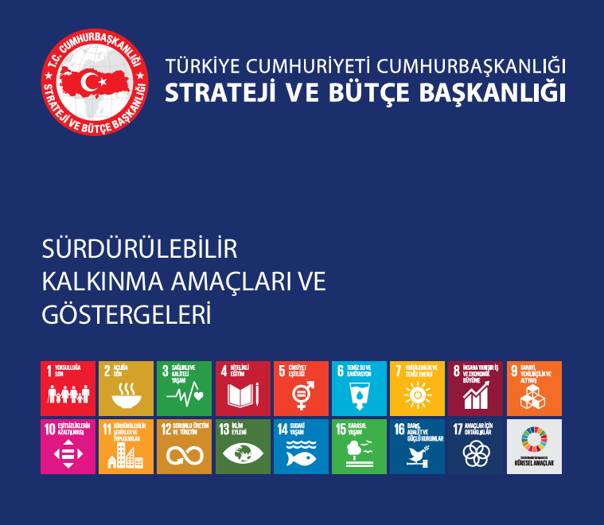

# SÜRDÜRÜLEBİLİR KALKINMA AMAÇLARI

## 1. YOKSULLUĞA SON
Yoksulluğun tüm biçimlerini her yerde sona erdirmek.

## 2. AÇLIĞA SON
Açlığı bitirmek, gıda güvenliğine ve iyi beslenmeye ulaşmak ve sürdürülebilir tarımı desteklemek.

## 3. SAĞLIKLI VE KALİTELİ YAŞAM
Sağlıklı ve kaliteli yaşamı her yaşta güvence altına almak.

## 4. NİTELİKLİ EĞİTİM
Kapsayıcı ve hakkaniyete dayalı nitelikli eğitimi sağlamak ve herkes için yaşam boyu öğrenim fırsatlarını teşvik etmek.

## 5. CİNSİYET EŞİTLİĞİ
Cinsiyet eşitliğini sağlamak ve tüm kadınlar ile kız çocuklarını güçlendirmek.

## 6. TEMİZ SU VE SANİTASYON
Herkes için suyun ve sanitasyonun güvence altına alınması ve sürdürülebilir yönetimi.

## 7. ERİŞİLEBİLİR VE TEMİZ ENERJİ
Herkes için uygun fiyatlı, güvenilir, sürdürülebilir ve modern enerjiye erişimi sağlamak.

## 8. İNSANA YAKIŞIR İŞ VE EKONOMİK BÜYÜME
Kesintisiz, kapsayıcı ve sürdürülebilir ekonomik büyümeyi, tam ve verimli istihdamı ve herkes için insana yakışır işleri teşvik etmek.

## 9. SANAYİ, YENİLİKÇİLİK VE ALTYAPI
Dayanıklı altyapılar tesis etmek, kapsayıcı ve sürdürülebilir sanayileşmeyi desteklemek ve yenilikçiliği güçlendirmek.

## 10. EŞİTSİZLİKLERİN AZALTILMASI
Ülkelerin içinde ve aralarındaki eşitsizlikleri azaltmak.

## 11. SÜRDÜRÜLEBİLİR ŞEHİRLER VE TOPLULUKLAR
Şehirleri ve insan yerleşimlerini kapsayıcı, güvenli, dayanıklı ve sürdürülebilir kılmak.

## 12. SORUMLU ÜRETİM VE TÜKETİM
Sürdürülebilir üretim ve tüketim kalıplarını sağlamak.

## 13. İKLİM EYLEMİ
İklim değişikliği ve etkileriyle mücadele için acilen eyleme geçmek.

## 14. SUDAKİ YAŞAM
Sürdürülebilir kalkınma için okyanusları, denizleri ve deniz kaynaklarını korumak ve sürdürülebilir kullanmak.

## 15. KARASAL YAŞAM
Karasal ekosistemleri korumak, iyileştirmek ve sürdürülebilir kullanımını desteklemek; ormanları sürdürülebilir yönetmek, çölleşmeyle mücadele etmek, arazi bozunumunu durdurmak ve tersine çevirmek ve biyolojik çeşitlilik kaybını engellemek.

## 16. BARIŞ, ADALET VE GÜÇLÜ KURUMLAR
Sürdürülebilir kalkınma için barışçıl ve kapsayıcı toplumlar tesis etmek, herkes için adalete erişimi sağlamak ve her düzeyde etkili, hesap verebilir ve kapsayıcı kurumlar oluşturmak.

## 17. AMAÇLAR İÇİN ORTAKLIKLAR
Uygulama araçlarını güçlendirmek ve sürdürülebilir kalkınma için küresel ortaklığı canlandırmak.

## REFERANSLAR
- [Birleşmiş Milletler Sürdürülebilir Kalkınma Amaçları Sayfası](https://sdgs.un.org/goals)
- [T.C. Cumhurbaşkanlığı Strateji ve Bütçe Başkanlığı - Sürdürülebilir Kalkınma Amaçları](https://www.sbb.gov.tr/surdurulebilir-kalkinma-amaçlari/)